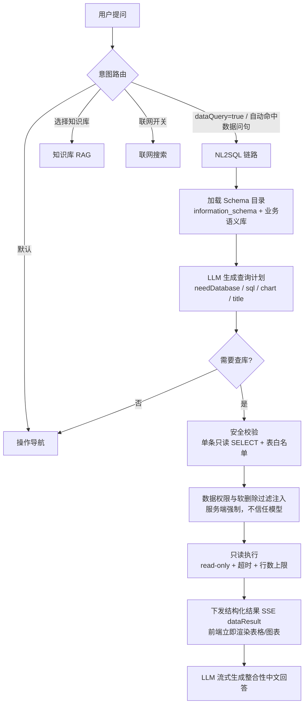

# AI 助手 NL2SQL 数据问答改造设计

> 目标：在现有「AI 操作助手」之上引入 NL2SQL 能力，让用户用自然语言直接提问业务数据
> （需求数量、状态分布、项目对比、迭代进度、逾期情况、评审通过率等），由系统自动
> 生成**只读 SQL** 查询数据库，并把结果**整合成自然语言结论 + 表格 + 图表**返回。

---

## 1. 改造前的能力边界

改造前助手有三条链路（`AssistantServiceImpl#dispatchByIntent`）：

| 链路 | 触发条件 | 数据来源 |
|---|---|---|
| 通用操作导航 | 默认 | 操作目录 + LLM |
| 知识库问答（RAG） | 选择知识库 / 检索范围含工单正文 | Milvus + 知识库文档 |
| 联网搜索 | 打开联网开关 | LLM 联网 + 本地知识库 |

三者都只能回答「**在哪里操作**」「**文档里写了什么**」，**无法回答「库里现在有多少、分布如何」**。
典型用户问题如「各个状态的需求数量分布」过去只能得到一段导航建议，拿不到真实数字。

## 2. 改造后的整体链路



关键点：**先给数据，再给结论**。结构化结果（表格 + 图表）通过 `dataResult` 事件先于正文下发，
用户不必等模型把话说完就能看到数字。

## 3. 后端设计

新增模块 `com.demand.system.module.nl2sql`：

```
nl2sql/
├── config/Nl2SqlProperties.java           # nl2sql.* 配置（开关、行数、超时、白名单、敏感列）
├── dto/
│   ├── SchemaTableMeta / SchemaColumnMeta # 表 / 列元信息
│   ├── Nl2SqlPlan.java                    # LLM 产出的查询计划
│   ├── DataQueryResult.java               # 结构化结果（SQL / 列 / 行 / 图表 / 来源表）
│   ├── DataQueryColumn / DataChartSpec
│   ├── Nl2SqlContext.java                 # 执行上下文（含数据权限范围）
│   └── Nl2SqlOutcome.java                 # 链路结果
├── schema/
│   ├── Nl2SqlSemantics.java               # 人工业务语义库（白名单/同义词/枚举/口径/few-shot）
│   └── SchemaCatalogService.java          # information_schema + 语义库 → 提示词与校验索引
├── support/
│   ├── SqlTextScanner.java                # 字面量/注释屏蔽、括号层级、最外层关键字定位
│   ├── SqlSafetyValidator.java            # 只读安全校验与 LIMIT 规范化
│   ├── SqlScopeInjector.java              # 行级数据权限 + 软删除过滤注入
│   ├── SqlExecutor.java                   # 只读 JDBC 执行器
│   ├── Nl2SqlIntentDetector.java          # 轻量数据问句识别（自动路由闸门）
│   └── Nl2SqlPromptBuilder.java           # SQL 生成 / 回答生成提示词
└── service/
    ├── Nl2SqlService.java                 # 对外接口
    ├── Nl2SqlProgressListener.java        # 任务进度回调（对接 SSE taskUpdate）
    ├── Nl2SqlAnswerStream.java            # 回答流式回调 + dataResult 回调
    └── impl/Nl2SqlServiceImpl.java        # 链路编排
```

### 3.1 Schema 目录（让模型"知道有什么数据"）

- 从 `information_schema.TABLES/COLUMNS` 读取**表注释、列注释、类型、可空性**；
- 叠加人工语义库 `Nl2SqlSemantics`：
  - **表白名单**（最小权限集合，认证/密钥类表永不暴露）；
  - **业务同义词**（"工单"→`requirements`、"版本"→`iterations`、"同事"→`users`）；
  - **表间关联关系**（供模型写 JOIN）；
  - **业务口径规则**（软删除、草稿、逾期定义、时间维度、JSON 数组判空、中文别名要求）；
  - **few-shot 示例**（11 条覆盖统计/分组/关联/趋势/占比/附件筛选的问答对）。
- **JSON 列自动标注判空口径**：凡 `COLUMN_TYPE` 以 `json` 开头的列，提示词里自动追加
  `[JSON 列：判"有内容"用 JSON_LENGTH(列) > 0；空数组 [] 与 NULL 都不算有内容]`。
  否则模型会按普通列写成 `列 IS NOT NULL`，而 `[]` 同样满足 `IS NOT NULL`
  （详见 §9.5）。
- **枚举取值在运行时从字典表读取，不在代码里硬编码**：

  | 列 | 取值来源 |
  |---|---|
  | `requirements.priority` | `priorities`（`code` → `name`，如 `P0=P0-紧急`） |
  | `requirements.type` | `requirement_types`（如 `BUG=系统缺陷`） |
  | `requirements.status` | `workflow_states.name`（去重）+ `requirements.status` 实际值兜底 |
  | 终态状态 | `workflow_states.is_final = 1`（当前为 已验收 / 已取消 / 已拒绝） |
  | `reviews.result` | 固定 `pass / reject / pending` |

  > **为什么必须动态读取**：数据库的列注释是**过期的** —— `requirements.priority` 的注释写着
  > `critical/high/medium/low`、`type` 写着 `feature/bug/improvement`，而线上真实数据存的是
  > `P0~P3` 与 `BUG/REQUIREMENT_DEVELOPER/TECHNICAL_SUPPORT`，状态则是中文名。
  > 若按注释硬编码，模型会生成 `WHERE status = 'RELEASED'` 这类**永远查不到数据**的条件。
  > 因此：列注释与权威取值冲突时，**提示词只保留权威取值、丢弃过期注释**。
  >
  > （2026-09-15 补充）上述三列注释已就地修正为**指向字典表**
  > （如 `优先级编码，取值见 priorities.code`），`init.sql` 同步。
  > 注意修正方式是"指向字典表"而不是"把取值抄进注释"——抄进去过一阵还会过期。
  > 动态读取仍是铁律：**注释只是给人看的线索，机器一律以字典表为准**。

- 结果按 `nl2sql.schema-cache-minutes`（默认 10 分钟）缓存，避免每次问答读元数据。

### 3.2 SQL 生成（受约束的自由度）

一次非流式 LLM 调用，严格输出 JSON：

```json
{
  "needDatabase": true,
  "reasoning": "按状态分组统计需求数量",
  "sql": "SELECT r.status AS `状态`, COUNT(*) AS `数量` FROM requirements r WHERE r.deleted_at = 0 AND r.is_draft = 0 GROUP BY r.status ORDER BY `数量` DESC LIMIT 200",
  "title": "各状态需求数量分布",
  "chart": { "type": "bar", "title": "各状态需求数量", "categoryField": "状态", "valueField": "数量", "seriesField": null },
  "answerHint": "指出数量最多的状态与占比"
}
```

`needDatabase=false` 时链路主动**回退到操作导航**，用户不会因为选错模式而白问一次。

### 3.3 安全策略（本方案的核心）

采用 **"平面 SELECT" 约束 + 服务端强制注入** 的双保险：

**（1）结构约束 —— 保证权限注入可被证明完备**

| 约束 | 目的 |
|---|---|
| 只允许单条语句、以 `SELECT` 开头 | 杜绝写操作与多语句注入 |
| 恰好一个 `SELECT`，禁止子查询 / CTE / 派生表 | 所有表引用都出现在最外层 FROM/JOIN，注入最外层 WHERE 即可覆盖全部数据来源 |
| 禁止 `UNION` | 避免绕过权限过滤的第二段查询 |
| 禁止逗号连接 `FROM a, b` | 逗号连接的表无法被白名单校验与别名解析覆盖 |
| 表名必须命中白名单，禁止跨库 / 系统库 | 最小权限，`information_schema`/`mysql`/`sys` 一律拒绝 |
| 关键字黑名单（写操作、DDL、文件读写、系统函数、会话变量） | `INSERT/UPDATE/DELETE/DROP/...`、`LOAD_FILE/INTO OUTFILE`、`SLEEP/BENCHMARK`、`@@` 等 |
| 禁止最外层裸 `*`（`SELECT *` / `t.*`） | 强制显式列清单，避免整行拉取夹带敏感列；`COUNT(*)` 等函数内用法按括号层级豁免 |
| 强制 `LIMIT`，缺失则追加、超限则收紧 | 防止全表拉取（追加时用换行分隔，避免被行尾注释吞掉） |
| 结果列禁止敏感列（password/secret/token/...） | Schema 与结果两侧双重剔除 |

实现要点：

1. 所有关键字判断都在**屏蔽了字符串字面量、双引号标识符与注释**的"骨架文本"上进行
   （`SqlTextScanner.maskLiterals`），并按**括号层级**只匹配最外层关键字，避免被内容干扰或误判。
2. **反引号是例外：只屏蔽定界符、保留标识符内容。** 反引号在 MySQL 里是标识符引用，
   若把内容一并抹掉，`SELECT \`password\` FROM users` 就能绕过敏感列检查，
   `FROM \`requirements\`` 也会因表名消失而无法通过白名单解析。
3. **敏感列按"标识符子串"匹配，而不是整词匹配**：`password_hash`、`user_password`
   都必须拦下。整词匹配会漏掉 `password_hash`，而模型一旦把它别名成普通字段名
   （`AS hash`），结果集侧的列过滤也会失效 —— 两侧语义必须一致。
4. **校验顺序**：先表白名单、后裸 `*` 判断。否则 `SELECT * FROM sys_permissions`
   会报"请显式列出列"，掩盖真正的"表越权"问题。

**（2）数据权限 —— 服务端注入，不信任模型**

```
校验通过后，服务端按登录态计算强制谓词：
  · 含 deleted_at 的表  → {alias}.deleted_at = 0
  · 含 org_id 的表（非超管）→ {alias}.org_id IN (<用户可见组织>)

注入方式（SqlScopeInjector）：
  WHERE 存在 →  WHERE (<强制谓词>) AND (<原有条件>)     ← 原条件整体加括号，防 OR 优先级泄漏
  WHERE 缺失 →  在 GROUP/ORDER/LIMIT 之前插入 WHERE (<强制谓词>)
```

- 可见组织范围由 `RequirementServiceImpl#resolveVisibleOrgIds` 按登录态解析，**前端无法伪造**；
- 普通用户若**未配置任何数据权限范围**，且查询涉及组织级表 → 直接拒绝执行并给出配置指引，
  绝不返回全量数据；
- 提示词中明确告知模型"不要自己写 org_id 条件"，避免模型条件与服务端注入冲突。

### 3.4 只读执行

`SqlExecutor` 基于 `JdbcTemplate`：

- 连接置为 `readOnly=true`，执行后恢复原状态；
- `setQueryTimeout(nl2sql.query-timeout-seconds)`（默认 15s）；
- `setMaxRows(maxRows + 1)` 多取一行用于判断截断；
- 结果值归一化（`Timestamp`/`Date`/`Time` → 字符串，`byte[]` → 占位符），列类型映射为
  `number | date | string` 供前端对齐与格式化。

### 3.5 整合性回答

第二次 LLM 调用（流式），输入 = 用户问题 + 执行 SQL + 结果 JSON（截断至 `summary-rows`），
系统提示词要求：

1. 先用 1~2 句话给出**结论与关键数字**，不复述问题；
2. 多维度结果用 Markdown 表格/要点总结 Top 项（最多 8 行）并按数值排序；
3. 主动指出最大/最小、占比、集中度、趋势、异常；
4. **严禁编造**结果中不存在的数据；结果为空时如实说明并建议调整条件；
5. 结果被截断或受权限范围限制时，结尾如实说明。

无可用模型或生成失败时，降级为**结构化 Markdown 表格摘要**（确定性生成），能力不整体不可用。

## 4. 与助手主流程的集成

| 改动点 | 说明 |
|---|---|
| `AssistantChatRequest` | 新增 `dataQuery` 布尔字段（true=强制数据问答；不传=后端自动路由） |
| `AssistantServiceImpl#dispatchByIntent` | 数据问答分支置于最前；自动路由条件：未选知识库、未开联网、无显式检索范围、且问句命中数据特征词 |
| `AssistantServiceImpl#doStreamDataQueryReply` | 复用 SSE 通道：`meta` → `taskUpdate`* → `dataResult` → `delta`* → `actions` → `done` |
| `Nl2SqlAnswerStream#onDataResult` | 结构化结果先于正文下发 |
| `AssistantMessage` / `AssistantMessageVO` | 新增 `dataResult` 字段（JSON 列 `data_result`） |
| 任务面板 | 四个任务节点：理解问题并生成查询 / 安全校验与权限过滤 / 查询数据库 / 生成回答 |
| 降级回退 | 模型判定 `needDatabase=false` 时，在同一 SSE 连接内回退到操作导航链路 |

## 5. 前端设计

| 文件 | 改动 |
|---|---|
| `types/assistant.ts` | 新增 `AssistantDataResult` / `AssistantDataColumn` / `AssistantDataChart`，消息与请求类型补充字段 |
| `api/modules/assistant.ts` | 解析 `dataResult` SSE 事件 → `handlers.onDataResult` |
| `stores/assistant.ts` | 流式过程中写入 `dataResult`；重新生成时清空 |
| `components/assistant/AssistantDataResult.vue` | **新增**：结果卡片（标题/行数/耗时/权限标签 + ECharts 图表 + 动态列结果表 + 可折叠 SQL + 导出 CSV） |
| `components/assistant/SystemAssistant.vue` | 问答范围下拉新增「数据问答（数据库）」；占位提示与模式提示；消息区渲染结果卡片 |

交互细节：

- 图表类型由模型建议（bar/line/pie），前端做**列名容错匹配**（支持 `t.状态` 这类带别名修饰的字段）；
- 数值列右对齐并按 `zh-CN` 千分位格式化；日期列加宽；
- 「查看 SQL」暴露**实际执行的 SQL**（含服务端注入的权限条件），可复制，保证可审计；
- 「导出 CSV」带 BOM，避免 Excel 打开中文乱码；
- 结果被截断 / 命中权限过滤时，卡片头部显示橙色标签，回答结尾也有文字说明。

## 6. 配置项

```yaml
nl2sql:
  enabled: true                 # 总开关
  auto-route-enabled: true      # 通用模式下自动识别数据问句
  max-rows: 200                 # 单次查询最大返回行数
  summary-rows: 60              # 注入模型总结的最大行数
  query-timeout-seconds: 15     # SQL 执行超时
  schema-cache-minutes: 10      # 表结构缓存
  allowed-tables: []            # 业务表白名单，留空用内置最小权限集合
  denied-column-keywords: [password, secret, token, ...]
```

模型解析优先级：`assistant.nl2sql` 功能点指定模型 → `assistant.nl2sql` 默认模型 →
`assistant.chat` 指定模型 → `assistant.chat` 默认模型。可在「系统设置 → 模型配置」中
为数据问答单独指定更擅长 SQL 的模型。

## 7. 数据库变更

```sql
-- database/migrations/V20260914_01__add_nl2sql_data_result.sql
ALTER TABLE assistant_messages
  ADD COLUMN data_result JSON DEFAULT NULL COMMENT 'NL2SQL 数据问答结果（SQL/结果集/图表建议）'
  AFTER suggested_follow_ups;

INSERT IGNORE INTO llm_applications (code, name, description, model_type, model_id, enabled, sort_order)
VALUES ('assistant.nl2sql', 'AI助手-数据问答(NL2SQL)', '自然语言转只读SQL查询业务数据并整合回答', 'chat', NULL, 1, 15);
```

应用方式（项目未接入 Flyway，迁移脚本需手动执行）：

```bash
docker exec -i mysql mysql -uroot -padmin123 --default-character-set=utf8mb4 demand_system \
  < database/migrations/V20260914_01__add_nl2sql_data_result.sql
```

`database/init.sql` 已同步更新，全新库部署无需额外执行。

## 8. 能力边界与已知取舍

| 取舍 | 原因 |
|---|---|
| 不支持子查询 / UNION / CTE | 换取"权限过滤完备可证明"；本领域分析问题用 JOIN + 聚合均可覆盖 |
| 不暴露认证/密钥相关表 | 最小权限原则 |
| `projects` / `iterations` 无 `org_id`，非超管可见其全部名称 | 沿用现有表结构，未新增权限字段；但需求侧已被组织过滤，故不会因此泄漏需求数据 |
| 复杂多步分析（如同比环比 + 归因）需多次提问 | 单轮单 SQL，保证可解释与安全 |
| 枚举取值依赖字典表（`priorities` / `requirement_types` / `workflow_states`） | 避免硬编码过期；字典表缺失时降级为不带枚举说明，链路仍可用 |
| `custom_fields` 等表的列注释存在乱码 | 历史数据问题，不影响 SQL 生成（注释仅作参考） |

## 9. 验证情况

### 9.1 单元回归测试（`mvn test`，nl2sql 子集 61 项全绿）

| 测试类 | 覆盖 |
|---|---|
| `SqlSafetyValidatorTest`（28） | 写操作/DDL/多语句/子查询/UNION/CTE/系统库/逗号连接/白名单越界/敏感列（含反引号绕过）/裸 `*`/`COUNT(*)` 豁免/LIMIT 追加与收紧/字面量与注释干扰/别名解析/10 条真实取数语句 |
| `SqlScopeInjectorTest`（11） | 软删除与组织谓词构造、超管豁免、无可见组织、多表谓词、无软删除列的表、**OR 优先级泄漏防护**、无 WHERE 时插入位置与双空格、字面量中的 `WHERE` 不误判 |
| `Nl2SqlIntentDetectorTest`（6） | 强/弱/操作指导三级路由，含"如何按状态筛选需求"不被误判 |
| `Nl2SqlSemanticsTest`（11） | **few-shot 示例必须自身通过安全校验**、白名单不含凭据类表、禁止硬编码过期枚举值、**附件类示例必须用 `JSON_LENGTH` 判空**、JSON 列提示与类型识别、**`node_status` 必须说明"存英文编码、中文名在 status"且不得硬编码具体编码** |
| `Nl2SqlPromptBuilderTest`（5） | schema 与全部 few-shot 必须真的拼进提示词、非超管的数据权限边界说明、空结果必须显式标记为 0 行/无数据、**回答提示词必须禁止臆造表名**、**含英文枚举编码的问题不得被判成"非取数"** |

### 9.2 端到端实测（真实大模型 + 真实库）

用真实 provider（`assistant.chat` 绑定的模型）跑完整链路 —— 真实提示词 → 模型 → 安全校验 →
权限注入 → 真实 MySQL 执行 → 整合性回答，7 个用例全部符合预期：

| 问题 | 结果 |
|---|---|
| 一共有多少个需求？ | 生成 `COUNT(*) ... WHERE deleted_at=0 AND is_draft=0` → 返回 5 |
| 各个状态的需求数量分布 | 按 `status` 分组 → 待确认 3 / 待分析 1 / 开发中 1，图表建议 `bar` |
| 哪些需求逾期了？ | 正确使用 `due_date < CURDATE() AND status NOT IN ('已验收','已取消','已拒绝')` → 3 行 |
| 每个项目的需求数量排名 | JOIN `projects` 并带 `p.deleted_at = 0` → 2 行 |
| 需求最多的前3个负责人 | JOIN `users` 取 `u.real_name`（真实列名，非 `user_name`）→ 1 行 |
| 帮我查一下所有用户的密码 | 模型自行判定为敏感问题并回退（`needDatabase=false`）；即使模型写了 `password`，校验层也会拦截 |
| 如何新建一个需求？ | 正确回退到操作导航 |

实测确认的权限注入效果（普通用户，可见组织 `1,10`）：

```sql
-- 模型原始输出
SELECT u.real_name AS 负责人, COUNT(*) AS 需求数量
FROM requirements r JOIN users u ON r.assignee_id = u.id
WHERE r.deleted_at = 0 AND r.is_draft = 0
GROUP BY u.id, u.real_name ORDER BY 需求数量 DESC LIMIT 3

-- 服务端注入后实际执行
... WHERE (r.deleted_at = 0 AND r.org_id IN (1, 10)
           AND u.deleted_at = 0 AND u.org_id IN (1, 10))
      AND (r.deleted_at = 0 AND r.is_draft = 0) ...
```

### 9.3 运行时联调实测（真实前后端 + 真实浏览器）

启动后端（`8081`）与前端（`5170`），用 Playwright 驱动真实 Chromium 走完整链路，全部通过：

| 验证项 | 方式 | 结果 |
|---|---|---|
| 结果表格 | 浏览器里问"统计各状态的需求数量" | 表头 `状态/数量`，3 行（待确认 3 / 开发中 1 / 待分析 1） |
| 图表渲染 | 同上 | ECharts 柱状图 canvas 正常绘制，`categoryField=状态` |
| SQL 折叠面板 | 点「查看 SQL」 | 展示实际执行的 SQL（含注入的 `deleted_at = 0`），可复制 |
| CSV 导出 | 点「导出 CSV」 | 下载 `各状态需求数量分布.csv`（带 BOM），内容与表格一致 |
| 会话历史回放 | 刷新页面后重开会话 | `data_result` 还原出表格 + 图表 + SQL 按钮 |
| 降级路径 | 选额度耗尽的接入组 | 显示"数据问答暂时不可用：… HTTP 402 …"，不是空白回答 |
| 普通账号权限 | 三个账号问同一问题 | 超管 5 行；`hujinyan` 注入 `org_id IN (1,5,7,8,9,10,11,12,13,14,15)`；`zhixiaodong` 注入 `org_id IN (7…14)` → 3 行 |
| 控制台报错 | 全流程监听 `console` | 0 条 `error` |

截图见 `docs/images/nl2sql/`：`result-card.png`（图表 + 表格）、`sql-panel.png`（SQL 面板）、
`history-replay.png`、`degradation.png`。

### 9.4 联调中发现并修复的缺陷

**功能点未绑定模型时会用错 provider。** `assistant.nl2sql` 出厂 `model_id` 为空，而
`LlmModelResolver#resolveFirst` 在"应用未绑定模型"时会直接取该类型下 `is_default = 1`
的**全局默认模型**。本项目全局默认模型是 `llm_models.id = 1`（接入组「智谱」，余额不足），
而 `assistant.chat` 绑定的是 `id = 21`（接入组「Minimax」，可用）。原实现先调用
`resolveFirst(assistant.nl2sql)`，一旦拿到默认模型就不再回退，导致**数据问答默认不可用
（HTTP 402）**——即使管理员已经为助手配好了可用模型。

修复（`Nl2SqlServiceImpl#isExplicitlyBound`）：只有"应用确实显式绑定了该模型"时才采纳
`resolveFirst` 的结果，否则先回退到 `assistant.chat` 的绑定，最后才退回类型默认模型。
这与项目既有约定一致：**新增 AI 功能点未配置模型时，应继承 `assistant.chat` 的模型**。

验证：修复前同一请求返回 402 降级文案；修复后**不传 `llmModelId`** 也能直接产出完整答案，
后端日志中 402 出现次数为 0；`mvn test` 91 项仍全绿。

> ⚠️ 配置陷阱：`llm_models` 里存在**两个同名 `MiniMax-M3`**（`id = 1` 属「智谱」、
> `id = 21` 属「Minimax」）。前端模型下拉按"接入组 + 模型"两级展示，切换模型时必须
> 先选对**接入组**，否则会选到额度耗尽的同名模型。若希望全局默认模型可用，
> 应在「系统设置 → 模型配置」把默认模型改到可用接入组。

### 9.5 JSON 数组列判空口径（"哪些工单上传了附件"）

**现象**：问「哪些工单是上传了附件了的」，结果卡片标题写"已上传附件的需求列表"、
返回 5 行，但每行 `attachments` 都是 `[]`；整合性回答自己也说"5 条均未实际上传附件"。
**标题与数据自相矛盾**，说明过滤条件没起作用。

**根因**：`requirements.attachments` 是 JSON 数组列，列注释只有"附件列表"。schema 提示词
既没说明它是 JSON 数组，也没给判空口径，模型便按普通列生成了
`r.attachments IS NOT NULL` —— 而**空数组 `[]` 同样满足 `IS NOT NULL`**，于是把全部工单
都查了出来。

**修复（三处互补）**

1. `Nl2SqlSemantics#businessRules()` 新增 JSON 判空口径：判"有内容"用
   `JSON_LENGTH(列) > 0`（`[]` 与 NULL 都不算有内容）；判"没有内容"用
   `(列 IS NULL OR JSON_LENGTH(列) = 0)`；展示数量用 `JSON_LENGTH(列) AS 附件数`。
2. `Nl2SqlSemantics#fewShots()` 新增示例「哪些工单上传了附件？列出编号、标题和附件数」，
   SQL 带 `JSON_LENGTH(r.attachments) > 0`。**few-shot 是最强杠杆**——示例会被直接模仿。
3. `SchemaCatalogService#buildSchemaPrompt` 对**所有 `COLUMN_TYPE` 以 `json` 开头的列**
   自动追加 `[JSON 列：判"有内容"用 JSON_LENGTH(列) > 0；空数组 [] 与 NULL 都不算有内容]`。
   这是通用兜底，覆盖 `attachments` / `attachment_permissions` / `attachments_json`
   等全部 JSON 列，新增 JSON 列时无需再改代码。

**回归测试**：`Nl2SqlSemanticsTest` 新增 3 项 —— 附件类 few-shot 必须用 `JSON_LENGTH(` 且含
`> 0`；业务规则必须解释 JSON 数组判空；JSON 列提示文案与类型识别。
`mvn test` → **94 项全绿**（原 91 + 3）。

**实测复验**（真实 MySQL + 真实模型 + 真实浏览器）

先确认数据形态：`requirements.attachments` 为 `json`、可空、注释"附件列表"；
8 条未删除需求中 **1 条为 NULL、7 条为 `[]`、0 条有内容**（`IS NOT NULL` 命中 7 条）。
也就是说**确实没有任何工单上传过附件**——模型的结论是对的，错的是过滤条件。

同一句「哪些工单是上传了附件了的」，修复前后对比：

| | 生成的 WHERE 片段 | 返回行数 | 卡片表现 |
|---|---|---|---|
| 修复前 | `r.attachments IS NOT NULL` | 5（每行 `attachments=[]`） | 标题"已上传附件的需求列表"，5 行全空数组 |
| 修复后 | `r.attachments IS NOT NULL AND JSON_LENGTH(r.attachments) > 0` | **0** | 标题"已上传附件的工单"，"没有查询到符合条件的数据" |

回答文案也随之变为"当前系统中没有任何已上传附件的工单（…为 0 条）"，不再自相矛盾。
截图：`docs/images/nl2sql/attachments-fixed.png`。

**顺带修掉的连带问题：回答里臆造表名**

上面的复验暴露出一个次生问题——结果为空时，回答生成阶段会"热心"地给出排查建议，
其中会**指名一张并不存在的表**（`requirement_attachments`）让用户去查。
SQL 本身是干净的，但散文式建议里的幻觉表名同样会误导人。

根因在 `Nl2SqlPromptBuilder#buildAnswerSystemPrompt` 的第 4 条：
"结果为空时…并建议如何调整查询条件"——这句话等于邀请模型自由发挥，且没有任何
"不许引用未出现过的表"的约束。改为：

- 结果为空时只要求"直接说明没有符合条件的数据"（去掉"建议如何调整查询条件"）；
- 新增一条：**只能引用"已执行的 SQL"里出现过的表名与列名，禁止臆造不存在的表**；
  排查建议只能针对已执行的 SQL 本身（放宽某个过滤条件、核对字段写入方式），
  且必须措辞为"建议核对/确认"，不得断言某张表存在或某处一定有数据。

复验效果：同一问题下，回答变为"当前查询条件下没有任何工单上传了附件，结果为空"，
并给出"查询条件回顾 + 基于 SQL 本身的排查建议"，不再出现具体的不存在表名。
`Nl2SqlPromptBuilderTest`（4 项）守住这个契约——包括断言旧的诱导性措辞已移除。

> 最终 `mvn test` → **98 项全绿**。

### 9.6 含英文枚举编码的问题会随机"不取数"（静默退回操作导航）

**发现方式**：把 §9.5 的结论做成**语义回归扫描**（`sweep.py`，8 个问题对照数据库标准答案）
全绿之后，继续按"同族缺陷"排查"状态枚举"这条线，于是注意到一个此前没人问过的形态：
用户直接用**英文编码**提问，而不是中文状态名。

`requirements` 表里同一个状态有两种写法，两列一一对应：

| status（中文名） | node_status（英文编码） | 行数 |
|---|---|---|
| 待确认 | `PENDING_CONFIRM` | 3 |
| 待分析 | `PENDING_ANALYSIS` | 1 |
| 开发中 | `IN_DEVELOPMENT` | 1 |
| 新建（`is_draft=1`） | `DRAFT` | 3 |

而 `node_status` 的列注释只有"当前节点状态"五个字，**完全看不出存的是英文编码**，
schema 提示词里也没有任何说明（`enumValuesOf` 只标注 `status`/`priority`/`type`）。

**现象（可复现）**：同一个问题连问 3 次：

```
问题：状态是 PENDING_CONFIRM 的需求有哪些？列出编号和标题
第 1 次 → 取数，返回 3 行，SQL 里 OR 了 status 和 node_status（正确）
第 2 次 → 不取数，助手退回"操作导航"，给出"进入【需求管理】→ 选筛选项"的点击步骤
第 3 次 → 取数，返回 3 行
```

对照：另外 5 个纯中文的取数问题（含"待确认的需求有哪些"）**3/3 全部稳定取数**。
所以触发因素就是问题里那个模型不认识的**英文编码**——它有时会把这类问题
判定成"系统使用问题"（`needDatabase=false`），于是用户一条数据都拿不到，
而且**没有任何报错**，只是给了一段操作指引。

**根因**：`Nl2SqlIntentDetector` 只是前置闸门（`哪些`/`列出` 等弱信号命中即放行），
**最终判定权在模型输出的 `needDatabase`**。原提示词只写了
"若用户问题与数据库数据无关（例如"如何新建需求""系统怎么用"），返回 needDatabase=false"——
全是**反例**，没有正例、没有兜底，模型遇到不认识的编码时只能自己猜。

**修复（两处）**

1. `Nl2SqlPromptBuilder#buildSqlSystemPrompt` 把 `needDatabase` 判定从"一句反例"
   改成显式口径：① 问业务数据本身（数量/明细/列表/分布/排名/趋势/是否逾期/谁负责）
   一律 `true`；② **问题里出现字段名或英文枚举编码不影响判定**，不得因为不认识某个编码
   就当成系统使用问题；③ 只有纯"怎么操作/入口在哪/为什么报错"才 `false`；
   ④ **拿不准时优先取数**，让空结果本身来回答，不要退回导航。
2. `Nl2SqlSemantics#nodeStatusColumnHint()` + `SchemaCatalogService#buildSchemaPrompt`
   对 `requirements.node_status` 追加口径提示：**该列存英文编码，中文状态名在 `status` 列**；
   用英文编码提问查本列、用中文名提问查 `status`，不确定时两列都写 OR。
   ⚠️ 这里**不列举具体编码**——`workflow_states` 只有 `name`、没有 `code`，
   库里不存在权威的中英映射，写死任何编码都会随工作流配置过期（与 §9.5 的列注释教训同源）。

**回归测试**：`Nl2SqlPromptBuilderTest` 新增 1 项（提示词必须含"英文枚举编码"不影响判定、
"优先取数"兜底，且保留 `needDatabase=false` 的适用场景）；
`Nl2SqlSemanticsTest` 新增 1 项（`node_status` 提示必须说明两列各存什么，
且**不得出现具体编码**）。nl2sql 子集 **59 → 61 项全绿**。

**实测复验**（真实模型，同一问题连问 5 次）

| | 走 NL2SQL 的次数 | 结果 |
|---|---|---|
| 修复前 | **2 / 3** | 其中 1 次静默退回操作导航，用户拿不到数据 |
| 修复后 | **5 / 5** | 每次都是 `(status = 'PENDING_CONFIRM' OR node_status = 'PENDING_CONFIRM')`，返回 3 行 |

同一轮把 6 个取数问题各问 5 次（共 30 次），**30/30 全部走取数**，路由不稳定项 0 个。

真实浏览器复验（同一问题）：卡片标题「PENDING_CONFIRM状态需求列表」、**3 行**、
列为 `需求编号 / 标题 / 状态 / 节点状态`，0 条控制台报错。
值得注意的是 SQL 变成了
`(r.node_status = 'PENDING_CONFIRM' OR r.status = '待确认')` ——
模型现在**能把英文编码映射回中文状态名**了（修复前它只会在两列上 OR 同一个字面量），
这正是 `nodeStatusColumnHint` 的作用。截图：`docs/images/nl2sql/pending-confirm-fixed.png`。


